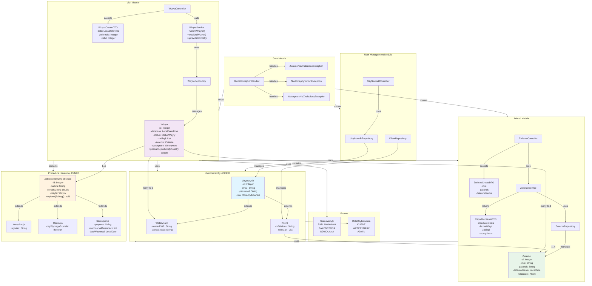
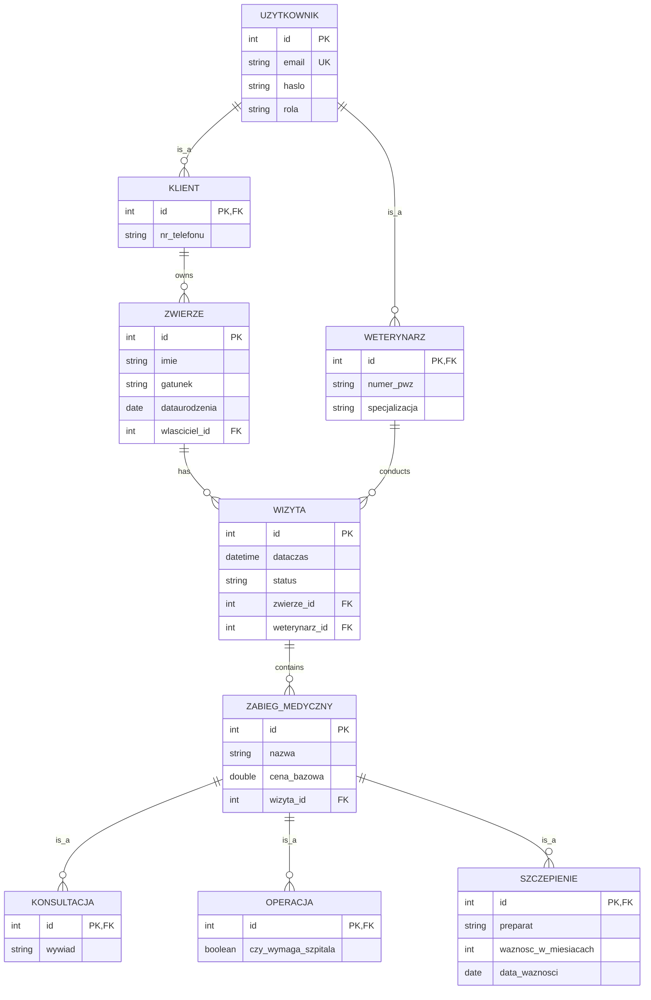

# Klinika Weterynaryjna - System Zarządzania Wizytami

## 📋 Opis Projektu

**Klinika Weterynaryjna** to aplikacja webowa oparta na Spring Boot, zaprojektowana do zarządzania wizytami, zwierzętami i procedurami medycznymi w klinice weterynaryjnej. System umożliwia:

- ✅ Rejestrację i zarządzanie zwierzętami
- ✅ Planowanie wizyt z automatycznym detekcją kolizji czasowych
- ✅ Realizację wizyt z wykonawaniem zabiegów medycznych
- ✅ Generowanie raportów leczenia
- ✅ Zarządzanie rolami użytkowników (Klient, Weterynarz, Administrator)
- ✅ Profesjonalne logowanie zdarzeń
- ✅ Walidację danych wejściowych

## 🚀 Uruchomienie Projektu

### Wymagania
- **Java 25+**
- **Maven 3.8+**
- **Spring Boot 4.0.6**
- **H2 Database** (wbudowana, brak konfiguracji)

### Kroki uruchomienia

1. **Klonowanie repozytorium**
```bash
cd /Users/kacper/IdeaProjects/Klinika-weterynaryjna
```

2. **Kompilacja i budowanie**
```bash
cd klinika-app
mvn clean compile
```

3. **Uruchomienie aplikacji**
```bash
mvn spring-boot:run
```

4. **Dostęp do aplikacji**
```
HTTP: http://localhost:8080
H2 Console: http://localhost:8080/h2-console
```

## 🏗️ Architektura Systemu

### Główne Komponenty

```
pl.klinika
├── Core                          # Wyjątkami i handlery
│   ├── GlobalExceptionHandler    # Centralna obsługa błędów
│   ├── ZwierzeNieZnalezioneException
│   ├── NiedostepnyTerminException
│   └── WeterynarzNieZnalezionyException
│
├── Uzytkownik                    # Zarządzanie użytkownikami
│   ├── Uzytkownik (klasa bazowa)
│   ├── Klient
│   ├── Weterynarz
│   ├── RolaUzytkownika (Enum)
│   ├── UzytkownikRepository
│   ├── KlientRepository
│   └── UzytkownikController
│
├── Zwierze                       # Zarządzanie zwierzętami
│   ├── Zwierze
│   ├── ZwierzeCreateDTO
│   ├── RaportLeczeniaDTO
│   ├── ZwierzeRepository
│   ├── ZwierzeService
│   └── ZwierzeController
│
└── Wizyta                        # Zarządzanie wizytami i zabiegami
    ├── Wizyta
    ├── StatusWizyty (Enum)
    ├── WizytaCreateDTO
    ├── ZabiegMedyczny (abstrakcyjna)
    ├── Konsultacja (konkretna implementacja)
    ├── Operacja (konkretna implementacja)
    ├── Szczepienie (konkretna implementacja)
    ├── WizytaRepository
    ├── WizytaService
    └── WizytaController
```

## 💡 Uzasadnienie Decyzji Projektowych

### 1. **Dziedziczenie dla ZabiegMedyczny (Strategy Pattern + Template Method)**

**Problem:** Kilka typów zabiegów medycznych (Konsultacja, Operacja, Szczepienie) z różnymi procedurami wykonania, lecz wspólnymi właściwościami (nazwa, cena, ID wizyty).

**Rozwiązanie:** Hierarchia klas z abstrakcyjną klasą bazową `ZabiegMedyczny`:

```java
@Entity
@Inheritance(strategy = InheritanceType.JOINED)
public abstract class ZabiegMedyczny {
    private Integer id;
    private String nazwa;
    private double cenaBazowa;
    private Wizyta wizyta;
    
    public abstract void wykonajZabieg(Wizyta wizyta);
}
```

**Korzyści:**
- 🎯 **Polimorfizm runtime** - każdy zabieg ma własną logikę (`Konsultacja.wykonajZabieg()`, `Operacja.ejecutarZabieg()`)
- 🗄️ **Efektywność bazy danych** - strategia `JOINED` minimalizuje redundancję (tabele normalizowane)
- 🔒 **Type Safety** - kompilator weryfikuje implementację metody abstrakcyjnej
- 📊 **Raport leczenia** - iteracja po zabiegi bez znania ich typu konkretnego:
  ```java
  for (ZabiegMedyczny zabieg : wizyta.getZabiegi()) {
      zabieg.wykonajZabieg(wizyta);  // Polimorficzna dyspozycja
  }
  ```

### 2. **Dziedziczenie dla Uzytkownik (Role-Based Access Control)**

**Problem:** Różne typy użytkowników (Klient, Weterynarz) z różnymi właściwościami.

**Rozwiązanie:** Hierarchia `JOINED` dla `Uzytkownik`:

```java
@Inheritance(strategy = InheritanceType.JOINED)
public class Uzytkownik { /* common fields */ }

public class Klient extends Uzytkownik {
    private String nrTelefonu;
    private List<Zwierze> zwierzaki;
}

public class Weterynarz extends Uzytkownik {
    private String numerPWZ;
    private String specjalizacja;
}
```

**Korzyści:**
- ✅ Separacja danych (Klient ma `zwierzaki`, Weterynarz ma `specjalizację`)
- ✅ Elastyczność - łatwo dodać nową rolę (np. `Administrator`)

### 3. **DTO (Data Transfer Objects) Pattern**

Wprowadzono `ZwierzeCreateDTO` i `WizytaCreateDTO` dla:

- 🔐 **Bezpieczeństwa** - nie expose całej encji do API
- ✔️ **Walidacji** - `@NotBlank`, `@Future`, `@Email` na poziomie DTO
- 🔄 **Separacji concern** - warstwa prezentacji niezależna od bazy danych
- 📝 **Dokumentacji** - jasne API - które pola są wymagane

### 4. **Enum zamiast magicznych stringów**

**Było:**
```java
wizyta.setStatus("ZAPLANOWANA");
if ("ZAKOŃCZONA".equals(status)) { ... }
```

**Teraz:**
```java
wizyta.setStatus(StatusWizyty.ZAPLANOWANA);
if (StatusWizyty.ZAKONCZONA.equals(status)) { ... }
```

**Korzyści:**
- 🛡️ **Type Safety** - możliwe wartości jasne w compile-time
- 🔍 **Refactoring** - zmiana enuma zmienia wszystkie references
- 📚 **Autocompletion** - IDE podpowiada dostępne wartości

### 5. **Projektowe decyzje walidacyjne**

- ✅ `@Valid` na DTO w kontrolerach
- ✅ `@Enumerated(EnumType.STRING)` dla enum'ów (czytelne w DB)
- ✅ Górna granica na datach wizyty (`@Future`)
- ✅ `@Email` dla adresów email
- ✅ Centralny `GlobalExceptionHandler` dla spójnej obsługi błędów

### 6. **Detekcja kolizji czasowych (30-minutowe okna)**

```sql
SELECT w FROM wizyta w 
WHERE w.weterynarz_id = :vetId 
AND w.dataczas < :dataczasKoniec 
AND DATE_ADD(w.dataczas, INTERVAL 30 MINUTE) > :dataczas
```

**Logika:**
- Każda wizyta trwa 30 minut
- Nowa wizyta `[start, start+30min]` nie może nachodzić na istniejące

### 7. **Logowanie zamiast System.out.println()**

```java
@Slf4j
public class Operacja extends ZabiegMedyczny {
    @Override
    public void wykonajZabieg(Wizyta wizyta) {
        log.info("Przeprowadzenie operacji dla: {}", wizyta.getZwierze().getImie());
        if (czyWymagaSzpitala) {
            log.warn("UWAGA: Operacja wymaga hospitalizacji!");
        }
    }
}
```

## 📦 Dependencje

```xml
<!-- Spring Framework -->
<spring-boot-starter-data-jpa>
<spring-boot-starter-webmvc>
<spring-boot-starter-validation>

<!-- Baza danych -->
<h2>

<!-- Narzędzia -->
<lombok>

<!-- Logging -->
<spring-boot-starter-logging> (SLF4J)
```

## 🗂️ Diagram Klas (Architecture Overview)



## 📊 Diagram Relacji Bazy Danych



## 🔌 Endpoints API

### Zwierzęta
```
POST   /api/zwierzeta?wlascicielId=1          - Rejestracja nowego zwierzęcia
GET    /api/zwierzeta/{zwierzeId}             - Pobranie danych zwierzęcia
GET    /api/zwierzeta/{zwierzeId}/historia    - Historia wizyt zwierzęcia
GET    /api/zwierzeta/{zwierzeId}/raport      - Raport leczenia zwierzęcia
```

### Wizyty
```
POST   /api/wizyty/umow                       - Umówienie nowej wizyty
PUT    /api/wizyty/{wizytaId}/zrealizuj       - Realizacja wizyty
```

### Użytkownicy
```
POST   /api/uzytkownicy/klient               - Rejestracja klienta
POST   /api/uzytkownicy/weterynarz           - Rejestracja weterynarza
GET    /api/uzytkownicy                       - Lista wszystkich użytkowników
```

## 🧪 Testowanie

### Przykładowe żądanie - Umówienie wizyty
```bash
curl -X POST http://localhost:8080/api/wizyty/umow \
  -H "Content-Type: application/json" \
  -d '{
    "data": "2026-06-15T14:00:00",
    "zwierzeId": 1,
    "vetId": 1
  }'
```

### Przykładowa odpowiedź - Raport leczenia
```json
{
  "imieZwierzecia": "Mruczek",
  "liczbaWizyt": 3,
  "zabiegi": [
    { "nazwa": "Szczepienie", "cena": 150.00 },
    { "nazwa": "Czyszczenie zębów", "cena": 200.00 }
  ],
  "lacznyKoszt": 950.00
}
```

## 🛡️ Obsługa Błędów

Wszystkie błędy są obsługiwane przez `GlobalExceptionHandler`:

```
404 NOT_FOUND     - Zwierzę/Weterynarz/Wizyta nie znaleziony(a)
409 CONFLICT      - Termin wizyty jest zajęty (kolizja)
400 BAD_REQUEST   - Błąd walidacji danych wejściowych
500 SERVER_ERROR  - Błąd serwera
```

## 📚 Technologie i Best Practices

| Aspekt | Technologia/Pattern |
|--------|------------------|
| **Framework** | Spring Boot 4.0.6 |
| **Baza danych** | H2 + JPA/Hibernate |
| **Walidacja** | Jakarta Validation |
| **Logowanie** | SLF4J + Logback |
| **Build Tool** | Maven |
| **Dependency Injection** | Spring DI |
| **ORM Pattern** | Active Record via Spring Data JPA |
| **Error Handling** | Centralized Exception Handling |
| **DTO Pattern** | Data Transfer Objects |
| **Inheritance** | JOINED Table Strategy (Polimorfizm) |
| **Code Generation** | Lombok |

## 📝 Licencja

Projekt jest dostępny dla celów edukacyjnych.

## 👨‍💻 Autorzy

Kacper 
Damian
Konrad

---

**Notatka:** Projekt demonstruje solidne zrozumienie:
- ✅ Polimorfizmu i dziedziczenia w OOP
- ✅ Architektur aplikacji (3-warstwowa: Controller → Service → Repository)
- ✅ JPA/Hibernate i relacyjnych baz danych
- ✅ Spring Boot best practices
- ✅ Walidacji i obsługi błędów
- ✅ RESTful API design
- ✅ SOLID principles
